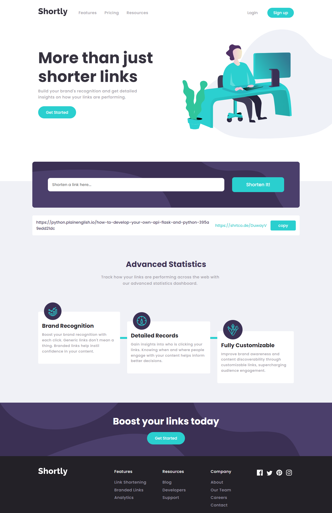
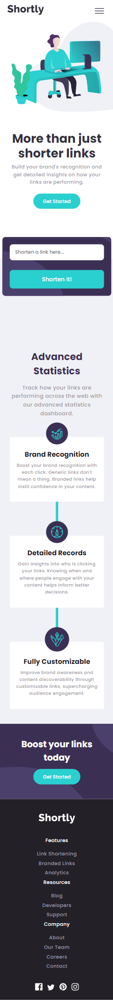
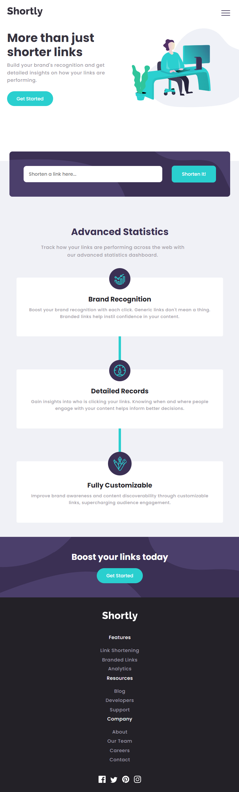
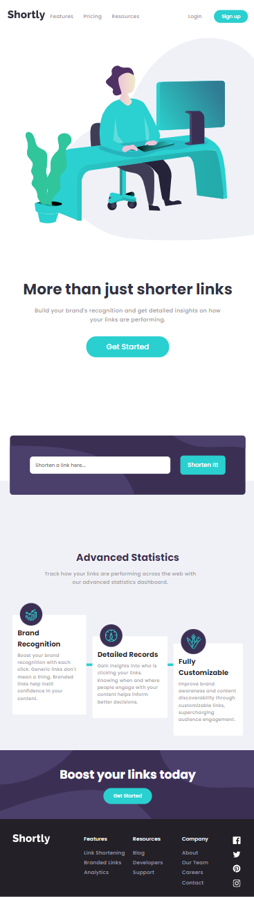
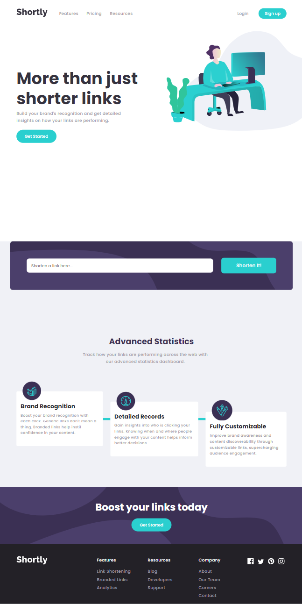

# Shortly URL shortening API Challenge solution



## Table of contents

- [Shortly URL shortening API Challenge solution](#shortly-url-shortening-api-challenge-solution)
  - [Table of contents](#table-of-contents)
  - [Overview](#overview)
    - [The challenge](#the-challenge)
    - [Links](#links)
    - [Screenshot](#screenshot)
  - [My process](#my-process)
    - [Built with](#built-with)
    - [What I learned](#what-i-learned)
    - [Run the project](#run-the-project)
    - [Useful resources](#useful-resources)
  - [Author](#author)

## Overview

### The challenge

Users should be able to:

- View the optimal layout for the site depending on their device's screen size
- Shorten any valid URL
- See a list of their shortened links, even after refreshing the browser
- Copy the shortened link to their clipboard in a single click
- Receive an error message when the `form` is submitted if:
  - The `input` field is empty

### Links

- Live Site URL: [easy bank landing page](link)

### Screenshot

- here are some screenshots about the application






## My process

### Built with

- Semantic HTML5 markup
- SASS preprocessor
- Flexbox
- JavaScript ES6+

### What I learned

- How to build **responsive** UI
- How to **shorten** an URL
- How to interact with **external API** using **fetch API**
- How to validate a URL using **regular expressions**
- How to listen for **'copy'** event
- How to use **spread operator**  to add multiple classses to an element (div)
- How to use **localStorage** to keep browser data 
- how to **destructure** an **object** to pull out data from localStorage  
  
### Run the project

To run this project simply install node dependencies and run sass, see below:

```shell
   npm install 
```

add to command in your package.json

```shell
"sass": "sass --watch scss/main.scss:dist/css/main.css"
```

then run a this command to watch sass

```shell
   npm run sass
```

### Useful resources

- [REGEX URL Validation](https://regexr.com/39nr7) - This helped me for URL validation.
- [hsl to hex](https://htmlcolors.com/hsl-to-hex) - This is an amazing tool that helps you to convert a hsl to hex color
- [how to copy to clipboard](https://www.w3schools.com/howto/howto_js_copy_clipboard.asp) - A great tutorial that helps me to figure it out how to copy a targeted text into **clipboard**
- [how to use localStorage on your project](https://developer.mozilla.org/en-US/docs/Web/API/Window/localStorage) - A well explained tutorial about **localStorage**

## Author

- Github [@mounir-m4](https://github.com/mounir-m4)
- Twitter - [@mounirmotawakil](https://twitter.com/mounirmotawakil)
- Frontend Mentor - [@mounir-m4](https://www.frontendmentor.io/profile/mounir-m4)